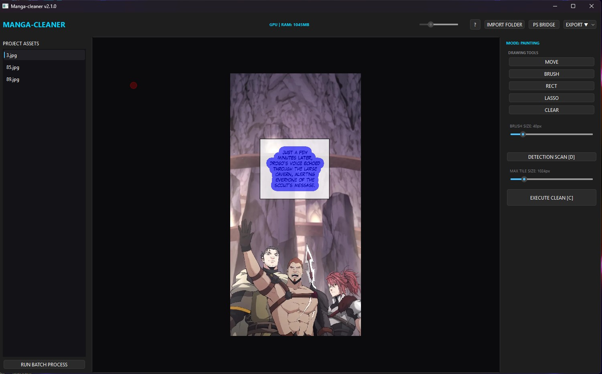
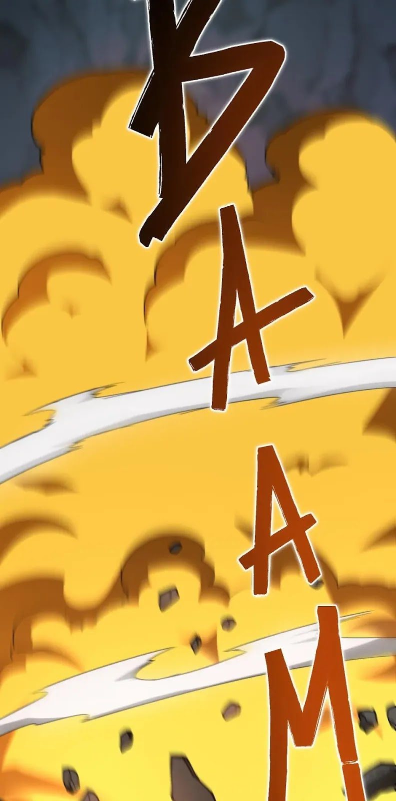
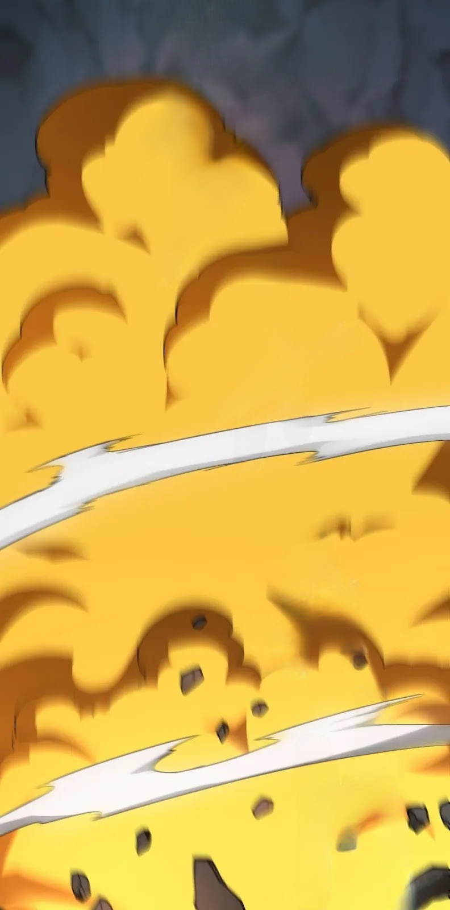
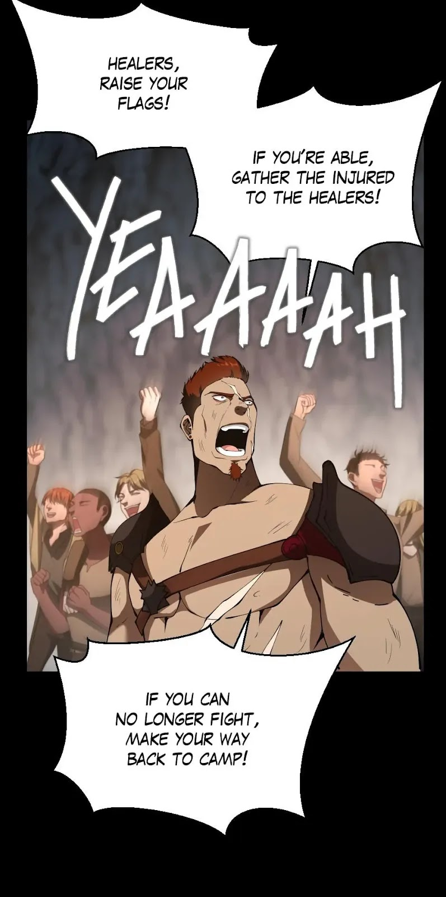
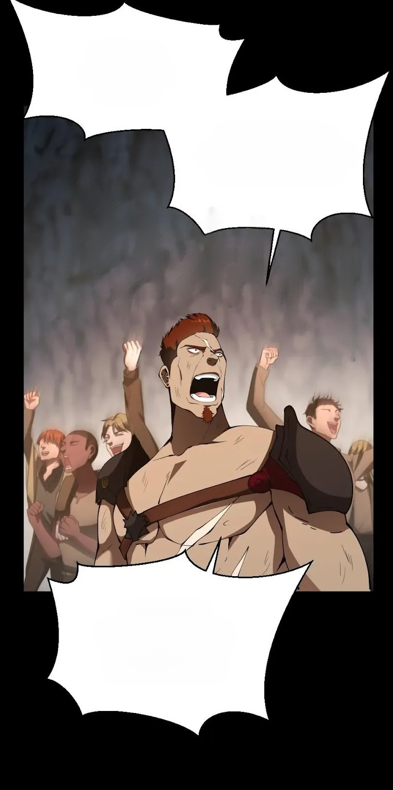

# 🌌 MANGA CLEANER v3.0.0: The Professional Studio Update
**High-Fidelity AI-Powered Scanlation Restoration Suite**

[](https://github.com/NeTRuNNeRGLiTCH/manga-cleaner/releases)
[](https://www.python.org/)

Manga Cleaner v3.0.0 represents a complete paradigm shift in scanlation technology. Moving from the legacy "script-based" architecture of v2.0.1 to a modular "Studio" engine, this update delivers unprecedented speed, precision, and hardware efficiency.

---

## 🖥️ Studio Preview (v3.0.0 UI)

*Featuring the new Obsidian Dark Theme and Hardware Telemetry.*

---

## 🚀 The v2.0.1 ➔ v3.0.0 Evolution

The jump to v3.0.0 isn't just an update—it's a total re-engineering of the restoration pipeline.

### 💎 Resolution-Invariant Tiling Engine (NEW)
In v2, tiling often resulted in slight quality degradation or blurring at the seams.
*   **v3 Improvement:** Our new **Dynamic ROI Engine** maintains 1:1 pixel integrity. By utilizing "Snap-to-8" reflection padding, the engine processes ultra-high 4K+ resolutions without downscaling, ensuring the output is as sharp as the original scan. No more Gaussian blurring needed—the seams are mathematically perfect.

### 📉 Massive GPU Footprint Optimization
We have successfully decoupled the runtime from unnecessary bloat.
*   **Size Reduction:** The GPU package has been slashed from **2.6GB down to 900MB** (download size) (and from 370 to 270 for CPU version) through aggressive dependency pruning and specialized ONNX runtime stripping, making it easier to download and share.

### 🧠 Advanced AI Core
*   **Detection:** Upgraded to a high-frequency heatmap OCR for pinpoint accuracy on Japanese, Korean, and Chinese text bubbles.
*   **Inpainting:** Fully migrated to a specialized ONNX-quantized LaMa core for 40% faster execution on both CPU and GPU.

---

## 📸 Before & After Comparison

| Original Scan | AI Restored (v3.0.0) |
| :---: | :---: |
|  |  |
|  |  |

---

## 📦 Version Comparison: GPU vs. CPU

| Feature | ⚡ CUDA GPU Edition | ☁️ Standard CPU Edition |
| :--- | :--- | :--- |
| **Ideal For** | High-end NVIDIA Gaming PCs | Laptops & Integrated Graphics |
| **Package Size** | ~900MB (Optimized) | ~260MB (Ultra-Lite) |
| **Cleaning Speed** | Instant / Real-time | 3-8 seconds per page | (takes time to load model first)
| **Hardware** | NVIDIA GPU (CUDA Required) | Any modern x64 Processor |

---

## 🎨 Professional Studio Features
*   **Batch Engine:** Process entire chapters in one click. Load -> Auto-Scan -> AI Clean -> Export.
*   **Selection Toolkit:** Added professional **Rectangular Selection** and **Lasso Tools** for manual mask refinement.
*   **Photoshop® Bridge:** Direct COM Interop. Cleaned pages are injected directly into Adobe Photoshop as layered documents.
*   **Integrated Help System:** A built-in manual and shortcut legend for a zero-friction learning curve.

### ⌨️ Key Shortcuts
*   `[D]` Auto-Scan Text | `[C]` Launch LaMa Clean | `[Space]` Pan Image
*   `[B]` Brush | `[R]` Rectangle | `[L]` Lasso | `[Shift]` Toggle Erase And Print Mode
*   `[Ctrl+Z]` Undo Image Change (LaMa) | `[Alt+Z]` Undo Manual Mask

---

## 🛠️ Technical Stack (For Developers)
*   **Language:** Python 3.12.7 (Strict OOP Architecture)
*   **GUI:** PySide6 (Qt6) with Obsidian Dark styling.
*   **Processing:** OpenCV 4.11 + NumPy 1.26.
*   **Async Logic:** Multi-threaded QThread workers to maintain 60FPS UI responsiveness during AI tasks.
*   **Telemetery:** Real-time RAM and VRAM monitoring via `psutil` and `onnxruntime` provider telemetry.

---

## 🗺️ Roadmap: The Future of Manga Cleaner
*   **v4.0.0 (Planned):** **AMD GPU Support** via DirectML Execution Providers and some of the community suggestions

---

## 📜 Community & Usage Policy
**Copyright © 2024-2026 NeTRuNNeRGLiTCH. All Rights Reserved.**

This project is built to empower the scanlation community. I want this tool to help you work faster and more professionally.

- **Profit from your Work:** You are 100% free to use this tool to clean manga for your scanlation groups, even if those groups accept donations or work on paid platforms. The output you create is yours.
- **Open for Learning:** You are welcome to study the source code, fork the repo, and modify it for your own personal use or to suggest improvements to this project.
- **Strict Commercial Restriction:** You are strictly prohibited from selling this software, its source code, or any modified versions of it. You cannot "re-skin" this app and put it behind a paywall.
- **Attribution:** While not required, a shout-out to this repo helps the project grow!

---

## ⚙️ Development Installation (Source Only)
1. **Clone & Environment:**
   ```bash
   git clone https://github.com/NeTRuNNeRGLiTCH/manga-cleaner.git
   cd manga-cleaner
   python -m venv venv
   .\venv\Scripts\activate
